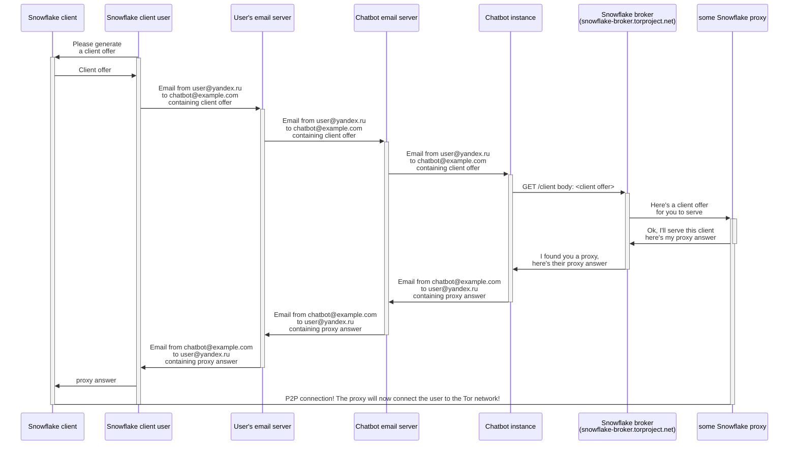

# snowflake-rendezvous-email-chatbot

Email chatbot for the snowflake project that helps conneting the proxy and the client through webRTC by forwarding the offer and answer between the broker server and the client.

## Install
```
pip install -r requirements.txt
```

## How to use
First register an email addres on the bot:
```
./chatbot.py init example@domain.com PASSWORD
```

Then you can run all registered email addresses:
```
./chatbot.py serve
```

Or you can only run one:
```
./chatbot.py. --account example@domain.com serve
```
## Test
[Click to test](mailto:example@domain.com?body=1.0%0A%7B%22offer%22%3A%22%7B%5C%22sdp%5C%22%3A%5C%22v%3D0%5C%5Cr%5C%5Cno%3D-%20123456789%20987654321%20IN%20IP4%200.0.0.0%5C%5Cr%5C%5Cns%3D-%5C%5Cr%5C%5Cnt%3D0%200%5C%5Cr%5C%5Cna%3Dfingerprint%3Asha-256%2012%3A34%5C%5Cr%5C%5Cna%3Dextmap-allow-mixed%5C%5Cr%5C%5Cna%3Dgroup%3ABUNDLE%200%5C%5Cr%5C%5Cnm%3Dapplication%209%20UDP%2FDTLS%2FSCTP%20webrtc-datachannel%5C%5Cr%5C%5Cnc%3DIN%20IP4%200.0.0.0%5C%5Cr%5C%5Cna%3Dsetup%3Aactpass%5C%5Cr%5C%5Cna%3Dmid%3A0%5C%5Cr%5C%5Cna%3Dsendrecv%5C%5Cr%5C%5Cna%3Dsctp-port%3A5000%5C%5Cr%5C%5Cna%3Dice-ufrag%3ACoVEaiFXRGVzshXG%5C%5Cr%5C%5Cna%3Dice-pwd%3AaOrOZXraTfFKzyeBxIXYYKjSgRVPGhUx%5C%5Cr%5C%5Cna%3Dcandidate%3A1000%201%20udp%202000%208.8.8.8%203000%20typ%20host%5C%5Cr%5C%5Cna%3Dend-of-candidates%5C%5Cr%5C%5Cn%5C%22%2C%5C%22type%5C%22%3A%5C%22offer%5C%22%7D%22%2C%22nat%22%3A%22unrestricted%22%2C%22fingerprint%22%3A%222B280B23E1107BB62ABFC40DDCC8824814F80A72%22%7D)

## How it works

If below you see a block of text instead of a diagram, go [here](https://mermaid.ink/img/pako:eNq9VU1v2zAM_SusLt2wOAN2NIqg6Ae2nhag2WXIRbHpWI0terLcxCj630dJduPECXpZl5NEUe-9kE_0i0goRRGLGv80qBO8U3JtZLnUwL9KGqsSVUlt4VHTNivkBiEpFGo7zvhVowFZjzKh4YOQ7lOi2ezLKCmGeYGyRlijRiMtXq3MTPYIlGU9hEyseuZzjxVCI0Jm8Mcx3I7u7yW41WUNWEpVAK-f3YV7v8sMlV72dSt1irupaZweS5Dk0q7IXuNOllWB04RKd5KQtlJppdcnJJ8gCgpuA9h_kDDsU8_KreqXStdWcvdD8ilZB4I_XuONoc2xm1Y-5mA-1X0wCsGpJVMZesLETjXaz4f_w0sPiDF8v1_A1458RWkbw9VQymysZW5o1zopNZU40FO5eEjv5Hoinx7DDzTITT-0sBOfkYGWGuAq-dIe2XoeUEM0UDNs9Kb_52YCD5dF1xewuao7CgeeB9ayDepA6nrb13cvMto38gEyanTqFclwaTIAsjkqcwJrUNrofRufcQNXYGyegUXO0x47M3r3Mf8zCWcec9QNnI-i9DNtPDQPk8-Ow6h35fzbHJhL80NRpC9gkXc-hq1iT_HN_ti13gt1RnXrBfuW39aWzOYiEKV47NqjaBjRYiJKNFyXlL8zLy5pKRiwxKWIeZliJpvCLsVSv3KqbCw9tjoRsTUNToShZp2LOJNFzbumShm4-0i9RfmZ_ibq969_ASHZZsk?type=png).


